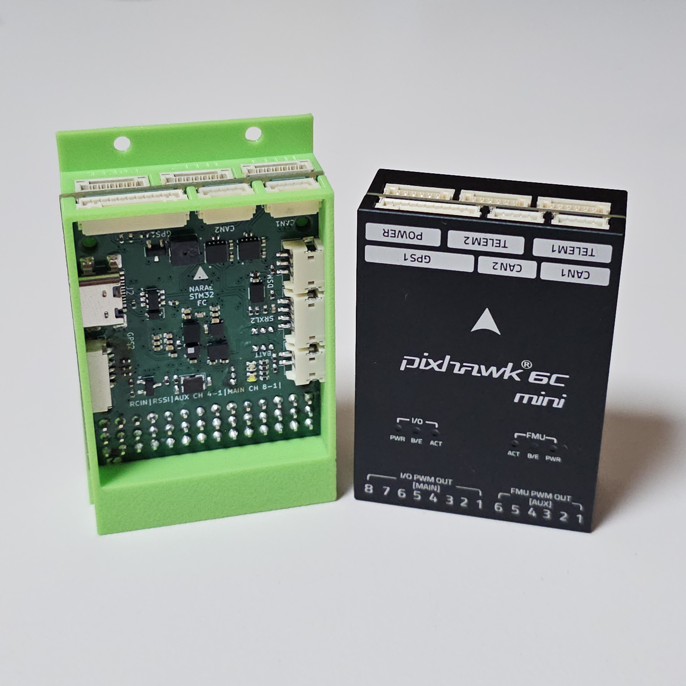

**본 문서는 STM32 하드웨어만을 다루고 있습니다.**

> [[STM32-FC]](https://github.com/NARAE-INHA-UNIV/STM32-FC) STM32 Firmware & Source code 

-----

# STM32-FC-hw

PCB 보드에 릴리즈 날짜와 버전이 기록되어 있지 않으면 v1.0.0 버전 입니다.

## 기여 (개발)

1. 프로젝트 fork
2. fork된 개인 레파지토리 clone
3. 코드 작성
4. 개인 레파지토리에 커밋 & 푸시
5. Pull-request

