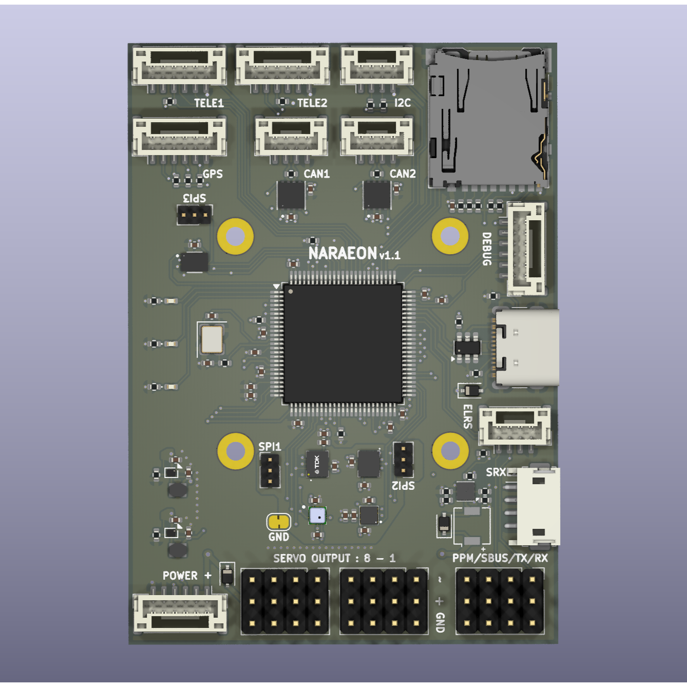

# NARAEON (나래온)

**NARAEON**은 인하대학교 모형항공기 동아리 '나래'(NARAE)에서 개발 중인 오픈소스 비행제어컴퓨터(FC) 프로젝트입니다. 이 프로젝트는 학술적 연구, 개발 그리고 취미 활동을 목적으로 하는 모든 분들을 위해 하드웨어, 펌웨어를 포함하고 있습니다.

## 🌟 프로젝트 소개
NARAEON은 무인항공기(UAV)의 핵심인 **비행제어컴퓨터**와 주요 센서들을 아우르는 통합 플랫폼입니다. 
저희는 항공전자 분야를 처음 배우는 학생들이 쉽게 학습하고 새로운 기능을 구현 및 창조할 수 있는 플랫폼을 제공하고자 이 프로젝트를 시작하게 되었습니다.

## ✨ 주요 특징
- 오픈소스: 하드웨어 회로도부터 펌웨어 소스 코드까지 모든 것이 공개되어 있어 누구나 자유롭게 사용하고, 수정하며, 기여할 수 있습니다.
- 통합 플랫폼: 비행 제어에 필요한 컴퓨터와 핵심 센서를 포함하여 안정적인 비행 제어 솔루션을 제공합니다.
- 확장성: 다양한 종류의 무인항공기에 적용할 수 있도록 설계되었으며, 사용자의 필요에 따라 기능을 쉽게 확장할 수 있습니다.
- 교육 및 연구: 학생, 연구자, 개발자들이 비행 제어 시스템의 원리를 깊이 있게 학습하고, 새로운 기술을 실험할 수 있는 훌륭한 교육 및 연구 도구입니다.

## 🚀 시작하기
프로젝트를 시작하는 데 필요한 정보는 각 저장소의 Wiki 페이지나 문서를 참고해 주세요. (링크 추가 예정)

하드웨어: [하드웨어 관련 저장소 링크]

- [STM32-FC](https://github.com/NARAE-INHA-UNIV/STM32-FC) : Firmware & Source code
- [NALDA](https://github.com/NARAE-INHA-UNIV/NALDA) : GCS

## 🔍 HW Spec.

> PCB 보드에 릴리즈 날짜와 버전이 기록되어 있지 않으면 v1.0.0 버전 입니다.
현재 최신 버전은 v1.1.0 입니다.

- ICM-45686 & ICM-42688-P dual IMU
- LIS2MDL eCompass
- ICP-20100 pressure sensor
- 내장 Flash memory & Micro SD card
- IBUS, SBUS, SRXL2, ELRS, PPM RC 프로토콜 지원

## 🤝 기여하기

NARAEON 프로젝트는 여러분의 참여를 언제나 환영합니다! 버그 리포트, 기능 제안, 코드 기여 등 어떤 형태의 기여도 프로젝트 발전에 큰 힘이 됩니다. 기여하고 싶으시다면 다음을 참고해 주세요.

1. 이 저장소를 Fork 하세요.
2. 새로운 기능이나 수정을 위한 Branch를 생성하세요 (git checkout -b feature/AmazingFeature).
3. 코드를 수정하고 Commit 하세요 (git commit -m 'Add some AmazingFeature').
4. Branch에 Push 하세요 (git push origin feature/AmazingFeature).
5. Pull Request를 열어주세요.

